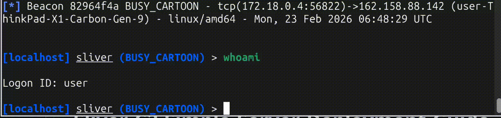

# Sliver-C2-Simple-Server-Deployment-Guide
<pre>
██████  ██      ██ ██    ██ ███████ ██████  
 ██       ██      ██ ██    ██ ██      ██   ██ 
  █████   ██      ██ ██    ██ █████   ██████  
      ██  ██      ██  ██  ██  ██      ██   ██ 
 ██████   ███████ ██   ████   ███████ ██   ██ 
</pre>
 >> Stealthy C2 Infrastructure on Azure <<
As a Red Teamer, you must know how to build your own C2 infrastructure. If you're a newcomer, follow the guide below to get started."

  

# Minimum System Requirements

Redirector: At least 1 vCPU and 1GB RAM.

C2 Server: At least 2 vCPUs and 2GB RAM.

In this section, I will guide you through the provisioning and setup process
